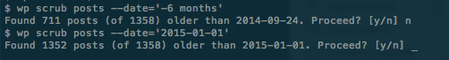

# Scrub Old Posts

Remove content older than a given date.

## Synopsis

`wp scrub posts --date=<date> [--post_type=<post_type>] [--posts_per_page=<num>]
  [--dry-run]`

## Options

    --date=<date>
      Delete posts older than this date.

    [--post_type=<post_type>]
      Post type. Default: post

    [--posts_per_page=<num>]
      Proccess in batches of <num>. Default: 100

    [--dry-run]
      Dry run. Only tell which images aren't found.

    [--yes]
      Answer "yes" to confirmation

## Examples

    wp scrub posts --date='-1 month'
    wp scrub posts --date='2015-01-01'

