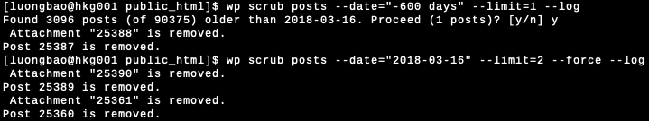

# Scrub Old Posts

Remove content older than a given date.

## Synopsis

    wp scrub posts --date=<date> [--post_type=<post_type>] [--posts_per_page=<num>] [--dry-run]

## Options

    --date=<date>
      Delete posts older than this date.

    --post_type=<post_type>
      Post type. Default: post

    --posts_per_page=<num>
      Proccess in batches of <num>. Default: 10

    --limit=<num>
      Limited how many post to process. Default: Unlimited

    --dry-run
      Dry run. Only tell which posts aren't found.

    --force
      Remove all posts are found without confirmation.

    --log
      Print log messages.

## Examples

    wp scrub posts --date='2015-01-01'
    wp scrub posts --date='-1 year' --force
    wp scrub posts --date='-3 months' --limit=50 --log

## Screenshots

## Change Log

**Nov 06, 2019**

- Add new options: `limit`, `force`, `log`
- Also remove all attachments of the post that be marked for removing.